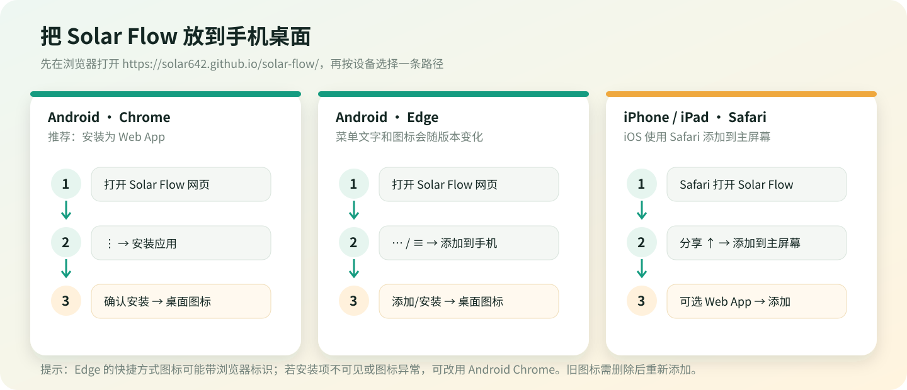

# 用户指南

Solar Flow 是本机优先的个人记账工具。新账本从 ¥0 开始；是否登录、是否启用云同步由你决定。开始前请先看[隐私与安全边界](PRIVACY.md)，尤其是云端数据访问范围。

## 第一次使用

1. 打开[在线版](https://solar642.github.io/solar-flow/)或在手机浏览器访问同一地址。
2. 进入“账本管理”→“设置总资产”，填写某一天结算后的真实总资产，并选择这笔余额的“截至日期”。
3. 如果你要从今天开始记账，接受默认的今天和当前总资产即可。若要补导旧流水，请先阅读下方[历史账单与总资产基准](#历史账单与总资产基准)。
4. 在“流水”页面点“记一笔”，选择支出/收入、日期和分类；商户可以留空。保存后总资产和资金分配按日期规则更新。

数据默认保存在当前浏览器。本机数据不会因为在另一台设备打开网页就自动出现；只有登录同一邮箱并验证后，才会启动云同步。

## 记一笔和账本

- 支出与收入都按人民币记录，金额按“分”保存；日期是交易发生日期，不是导入日期。
- 商户可选填，备注也可不填。系统根据商户名和账单类型给出分类，导入预览中可修改分类。
- 每个账本拥有独立流水、资产基准、资金分配、计划和借款/信用清单。新建账本不会复制或继承旧账本数据，总资产和余额从 0 开始。
- “撤销上一步”最多恢复当前设备/账本最近 30 次关键操作。撤销历史本身不跨设备同步。
- “清空当前账本”会清空当前账本的数据；先使用“导出当前账本”备份。清空不是 Firebase 账号删除，也不是物理删除云端文档。

## 导入微信、支付宝或其他账单

1. 从支付平台导出 XLSX、XLS、CSV 或 OFX 文件，在 Solar Flow 点“导入账单”并选择文件。
2. 在预览中选择来源标签。相同来源的重叠账单要继续用同一个标签，例如同一个微信导出源不要每次换标签。这个标签仅用于去重，不是一个账户，也不增加一份资产。
3. 核对日期、商户、方向、金额和分类。分类不确定的记录要调整；标记为“待确认”的匹配行不会自动写入。
4. 检查预览上的重复、新记录、匹配、待确认和不计收支数量，以及“总资产预估变化”。确认无误后再导入。
5. 导入后抽查流水与总资产。如选错文件或来源，可用“撤销上一步”恢复最近的导入操作。

### 去重会做什么、不会做什么

- 有平台流水号时，优先以“来源标签 + 流水号”判断是否已经导入。
- 没有流水号时，以来源、日期、收支方向、金额和标准化商户组成精确指纹。
- 与一笔手动记录方向/金额相同、日期相差不超过两天，且商户名高度相似时，唯一匹配项会合并来源信息。
- 日期/金额接近但商户不一致或有多个候选时，标为待确认，不会静默重复入账。
- 不同来源标签会被视为不同来源；系统不会保证自动识别“同一笔交易出现在两个不同平台导出文件里”的所有情况。不要为了导入方便而随意改来源标签。

更完整的键值和边界见[数据与同步规则](DATA_AND_SYNC.md#账单去重和匹配)。

### 内部转账

账单明确标为转账或中性/不计收支的行不会算作消费或收入。Solar Flow 没有微信、支付宝、银行卡的账户余额模型，也不会跨来源自动配对所有互转流水。若平台把两端分别导出为普通支出和普通收入，两边金额相等时它们对资产净额会抵消，但分类图仍可能各自显示；不相等或只导入一端时则不会自动抵消。请务必核对预览中的“内部流转/不计收支”标记。

## 历史账单与总资产基准

“总资产基准”表示：**在所选截至日期结算之后，你实际拥有的总资产是多少**。它是计算锚点，不是交易日期，也不是资金账户。

规则：

- 基准日前的流水仍可用于趋势、日历和历史统计，但不再重复改变当前总资产。
- 基准日之后的收入增加总资产，支出减少总资产。
- 基准日当天默认视为已经结算在基准金额内；设置“今天”时，此后新记的手工流水会按记账时间计入。账单导入通常只有日期没有精确时间，所以整天补算时应选首笔待补流水的前一天。
- 内部转账、失败、撤销或不计收支的行不改变总资产。

**例子：**10 月 9 日你手上有 ¥4,000，但这 ¥4,000 是截至 10 月 3 日的余额；随后 10 月 4 日至 9 日漏记了流水。设置总资产时填 ¥4,000、截至日期选 10 月 3 日，再导入 10 月 4 日起的账单，基准日后的新收入/支出就会重算当前余额。相反，如果 ¥4,000 已经包含截至 10 月 9 日的所有交易，就把 10 月 9 日设为基准日，避免把这些历史流水再次加减。

导入预览会显示预计变动和导入后总资产。若导入后不变化，常见原因是本批流水都早于/等于基准日，或全是重复、待确认、中性记录；先检查基准日期和预览统计，不要直接重复导入。

## 资金分配

资金类型是对同一总资产的虚拟分区，不是额外的钱。消费扣款顺序如下：

1. 生活资金
2. 其他资金（总资产扣除已分配金额后的余额）
3. 自由资金
4. 计划资金（按计划列表顺序扣减）
5. 紧急资金

生活资金不设目标线；紧急资金显示基于历史必要支出的动态建议线，不是硬性目标；每个计划可以单独填写目标金额，也可不设目标。若支出高于全部可用资金，流水仍会按真实金额记录并减少总资产，资金分区无法覆盖的部分不会凭空消失。

## 收支复盘与建议

- 可按周、月、半年、年查看收入或支出；趋势图/柱状图在同一卡片切换。
- 日历以“天”为单位汇总，不会为同一天的每笔交易重复显示日期。
- 资金建议只基于当前账本已记录的流水和资金余额。样本不足时会标注为初步参考或不提供强结论；建议不是投资、信贷或专业财务意见。
- 具体稳健基线、异常月份处理和建议线公式见[数据与同步规则](DATA_AND_SYNC.md#趋势和资金建议)。

## 跨设备同步

1. 在“设置”中创建邮箱账号并完成验证；未验证邮箱不会开启云同步。
2. 在电脑与手机上用同一邮箱登录，首次同步时先检查本机账本，再确认合并。
3. 之后联网时数据会自动同步；离线可继续在本机使用，联网后重试/补传。
4. 计划封面图片仅保存在原设备；计划名称、金额、目标、留言等记录可同步。另一台设备可能显示无封面。

云同步会传输解析后的账本交易数据，不传原始 CSV/XLSX 文件。项目不是端到端加密；公开版的存储和访问边界见[隐私说明](PRIVACY.md)。

## 手机快捷方式

访问地址：<https://solar642.github.io/solar-flow/>。先让页面完整加载一次，再按系统步骤添加。菜单名称会随浏览器版本略有不同。

### Android · Chrome（推荐）

1. 用 Chrome 打开 Solar Flow。
2. 点地址栏旁的“⋮”菜单。
3. 选择“安装应用”或“安装并创建快捷方式”；若显示“添加到主屏幕”，也可选择该项。
4. 确认“安装/添加”，回到桌面点 Solar Flow 图标打开。

Chrome 官方帮助说明，Android 上可从菜单安装 Web App；具体菜单标签依当前版本和站点安装状态而异：[使用 Web 应用](https://support.google.com/chrome/answer/9658361?co=GENIE.Platform%3DAndroid&hl=zh-CN)。

### Android · Edge

1. 用 Edge 打开 Solar Flow，点浏览器菜单（“…”或“≡”）。
2. 在菜单操作项中寻找“添加到手机（Add to phone）”“安装”或“添加到主屏幕”；有些版本需要横向滑动菜单图标才能找到。
3. 选择添加/安装并确认桌面位置。
4. 如果没有安装项，或图标显示 Edge 徽标/系统通用图标，可改用 Chrome 的“安装应用”。不同 Edge 版本和 Android 启动器对 Web App 图标的处理可能不同。

Edge 的移动菜单会随版本变化；微软官方说明可见[Edge 移动版常见问题](https://support.microsoft.com/en-us/microsoft-edge/microsoft-edge-for-mobile-faqs-29296eab-b76f-4a87-ac9c-9835da53465d)。Edge/Chromium 对 Android 主屏幕快捷方式与独立 WebAPK 的支持也有差异，详见[Microsoft Edge PWA manifest 文档](https://learn.microsoft.com/en-us/microsoft-edge/progressive-web-apps-chromium/webappmanifests)。

### iPhone / iPad · Safari（推荐且需使用 Safari）

1. 用 Safari 打开 Solar Flow。
2. 点“分享”按钮（方框向上箭头）。
3. 向下滚动操作列表，点“添加到主屏幕”。若没看到，滚动到列表底部，在“编辑操作”里添加该项目。
4. 可选择“作为 Web App 打开”（若系统显示该开关），再点“添加”。
5. 回到主屏幕点 Solar Flow 图标。iOS 的主屏幕网站图标只添加到当前设备。

步骤来自 [Apple：将网站图标添加到 iPhone 主屏幕](https://support.apple.com/guide/iphone/bookmark-a-website-iph42ab2f3a7/ios)。

如果旧图标仍显示，先删除旧快捷方式，再从对应浏览器重新添加；不要只把普通书签拖到桌面。快捷方式不是云同步，账本是否跨设备出现取决于是否登录同一账号并完成同步。

## 备份与故障处理

- 定期在“设置”导出当前账本；测试导入前可以先建独立测试账本。
- 不要通过截图、GitHub Issue 或聊天公开上传完整账单、邮箱、认证邮件、云端记录或 `.env.local`。
- 登录/同步异常时，本机账本仍可用；查看设置内的错误提示，联网后重试。若误清空或导入，可在最近 30 次撤销记录范围内撤销；重要数据仍应保留导出备份。
- 浏览器清理网站数据、卸载/重置浏览器可能移除本机账本。云同步不是本机导出的替代品。
